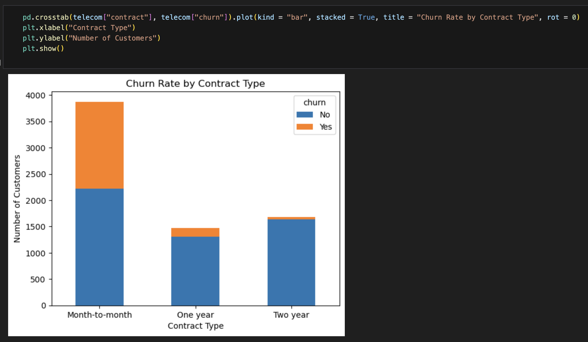
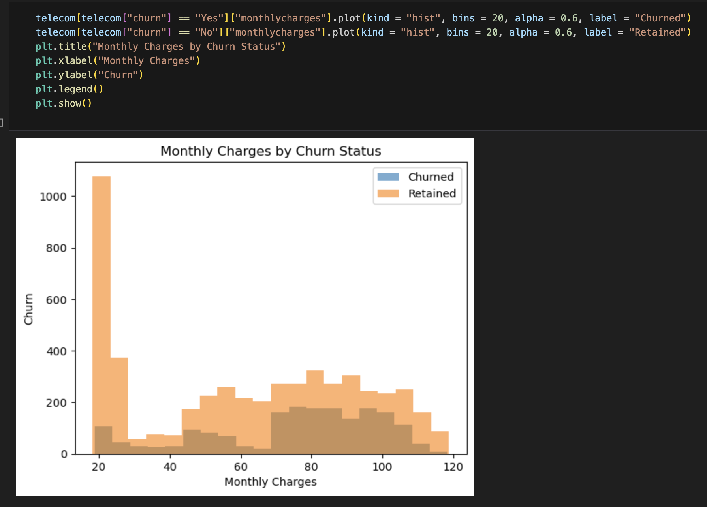
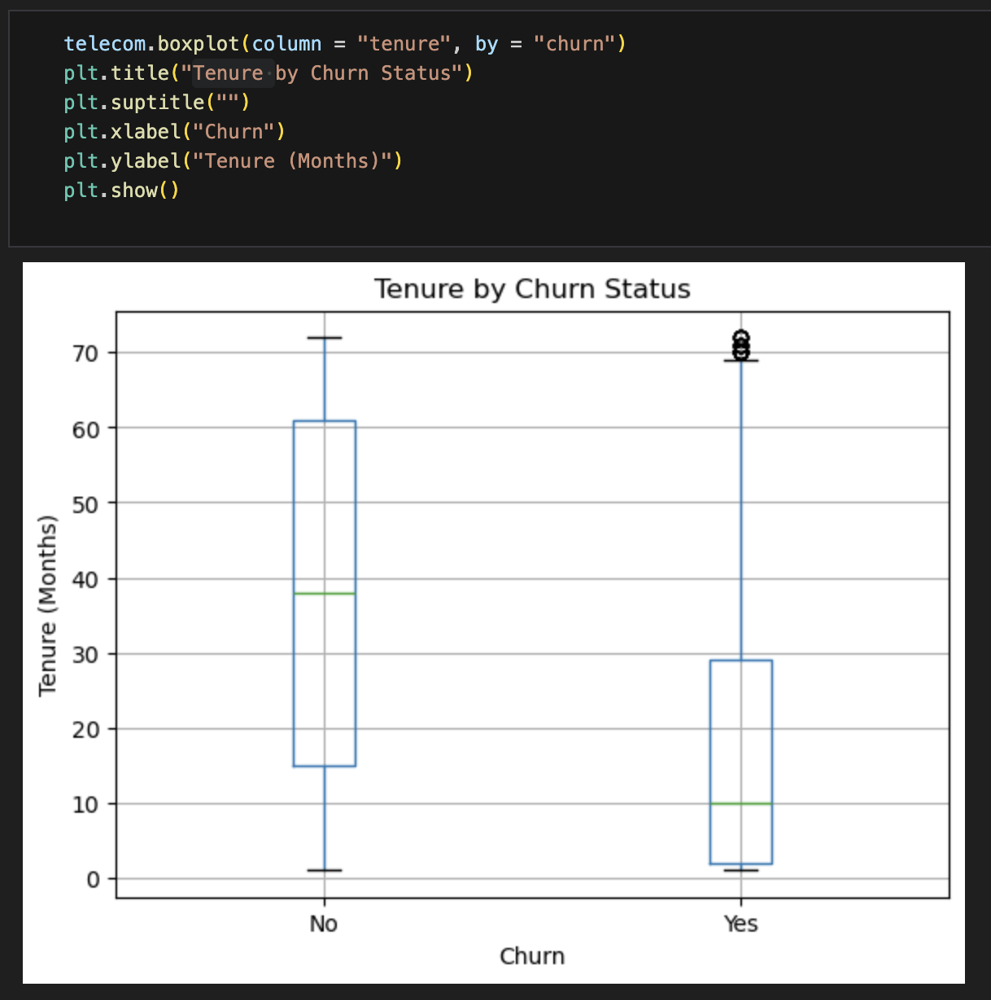

# Telecom Customer Churn Analysis

## Project Overview
This project analyzes telecom customer churn patterns to identify the factors most associated with customer attrition. The analysis focuses on customer demographics, billing behavior, tenure, and contract type in order to generate actionable retention insights for a telecom business.

--- 

## Tools Used
* Python
* Pandas
* Matplotlib
* Jupyter Notebook

---

## Methods Used
- Exploratory Data Analysis (EDA)
- SQL Queries
- Data Cleaning
- Customer Churn Analysis
- Data Visualization
- Business Recommendations

---

## Dataset

This dataset contains telecom customer account information, service usage details, monthly charges, contract types, tenure, and customer churn status.

---

## Key Questions
* What is the overall churn rate?
* Do churned customers have lower tenure?
* Are monthly charges associated with churn?
* Do churned customers have lower total charges?
* Does contract type influence churn?

---

## Key Findings
* Customers who churned generally had lower tenure.
* Customers who churned tended to have higher monthly charges.
* Customers who churned had lower total charges overall.
* Month-to-month contracts showed the highest churn rates.

---

## Recommendations
- Focus retention efforts on month-to-month contract customers.
- Improve onboarding and engagement for newer customers.
- Monitor customers with high monthly charges for churn risk.
- Develop loyalty incentives for long-tenure customers.

---

## Dataset
Source: Kaggle Telecom Customer Dataset

---

## Visualizations

